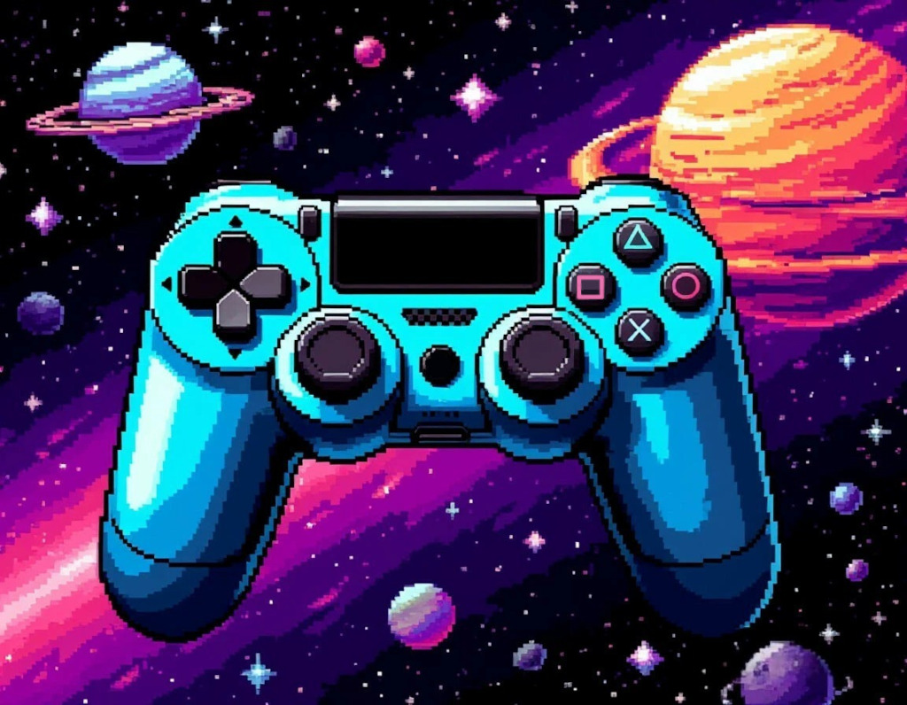

# 🕹️ Browser Games Collection



A collection of browser games built from scratch using **HTML5 Canvas**, **CSS**, and **TypeScript**.

I copy famous arcade games like a Flappy Bird, Alien Invasion etc. and also create my own for fun and improving my programming skills.

## ✨ Key Features

- **Original graphic assets:** Starting from Zombie Night game i paint my own in GIMP, Paint etc.
- **Hand-written code:** No AI generated code in games. Only this README :robot:
- **State Management:** LocalStorage integration for high scores and persistent game state.
- **Minimum tools:** No frameworks, no extra libraries. Only HTML5, CSS, TypeScript and Vite.
- **Weak math knowledge:** I have law education, wish me luck with Computer Science guys! :clown_face:

## 🛠️ Local Development

Interested in the code? Wanna run it locally?

**Prerequisites:**

- [Node.js](https://nodejs.org/en) (v18 or higher) installed on your machine.

1.  **Clone the repo:**

    ```bash
    git clone https://github.com/yurirodnov/browser-games.git
    ```

    or via SSH

    ```bash
    git clone git@github.com:yurirodnov/browser-games.git
    ```

2.  **Go to a specific game directory:**
    ```bash
    cd 001_space_invasion (or any another game folder)
    ```
3.  **Install dependencies:**
    ```bash
    npm install
    ```
4.  **Run the dev server:**
    ```bash
    npm run dev
    ```
5.  **Open the link shown in the terminal (usually `http://localhost:5173`)**.

6.  **Build for production (optional)**:
    ```bash
    npm run build
    npm run preview
    ```

## 📂 Project Structure

Each game is a standalone Vite project:

```text
/browser-games
  ├── 001_space_invasion/    # Source code for Space Invasion
  ├── 002_flappy bird/       # Source code for Flappy bird
  ├── 003_snake              # Source code for Snake
  ├── Another games folders...
  └── README.md
```

## 🎨 Design

- **CSS window background:** rgb(15, 13, 13);
- **CSS fonts:** Silkscreen
